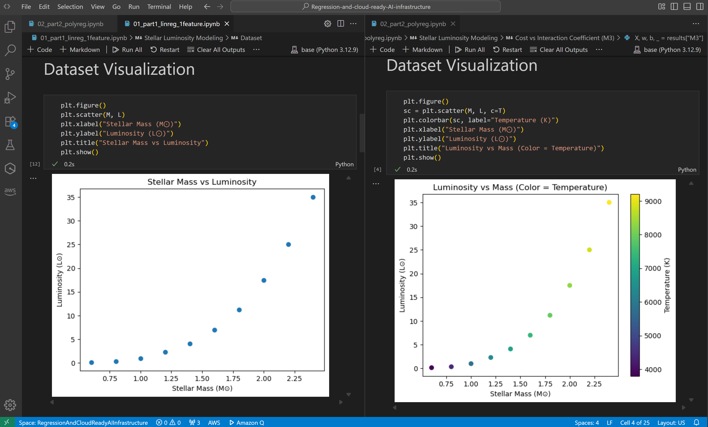
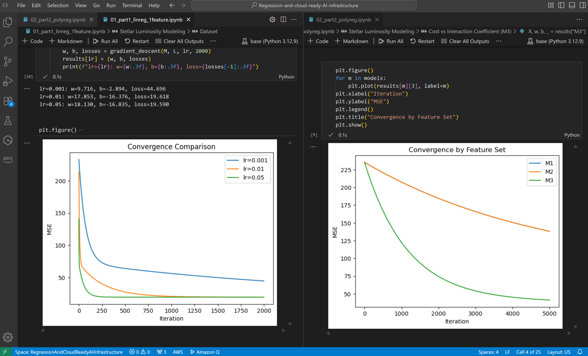

# Stellar Luminosity – Linear and Polynomial Regression from First Principles

## Overview

This repository contains the solution for the _Stellar Luminosity_ assignment, developed as part of a four-week **Machine Learning Bootcamp** within a course on **Digital Transformation and Enterprise Architecture**.

The objective is to model stellar luminosity using linear and polynomial regression implemented **from first principles**, without relying on machine-learning libraries. Beyond numerical correctness, the assignment emphasizes interpretability, architectural thinking, and cloud execution.

In an enterprise context, machine learning is treated as a **first-class architectural capability**, comparable to scalability, availability, and security. These notebooks demonstrate how intelligent behavior can be constructed, validated, and executed in controlled environments such as the cloud.

---

## Repository Structure

```
/
├── README.md
├── 01_part1_linreg_1feature.ipynb
└── 02_part2_polyreg.ipynb
```

---

## Part I – Linear Regression (One Feature)

**Notebook:** `01_part1_linreg_1feature.ipynb`

**Goal:**
Model stellar luminosity (L) as a linear function of stellar mass (M):

$$\hat{L} = wM + b$$

**Key elements:**

- Dataset visualization and physical interpretation
- Explicit hypothesis and mean squared error loss
- **Cost surface visualization** over (w, b)
- Analytical gradient derivation
- Gradient descent (loop-based and vectorized)
- Learning-rate experiments and convergence analysis
- Final fit and discussion of systematic errors
- Conceptual discussion on astrophysical meaning and model limitations

This notebook highlights why linear models are limited for stellar physics but remain useful as interpretable baselines.

---

## Part II – Polynomial & Interaction Regression (Two Features)

**Notebook:** `02_part2_polyreg.ipynb`

**Goal:**
Capture nonlinear and interaction effects using engineered polynomial features:

$$X = [M, T, M^2, M \cdot T]$$

**Key elements:**

- Multivariate dataset visualization with temperature encoding
- Vectorized feature engineering
- Vectorized loss and gradient computation
- Gradient descent training and convergence plots
- **Feature selection experiment**:
  - M1: [M, T]
  - M2: [M, T, M²]
  - M3: [M, T, M², M·T]
- Predicted vs actual plots for each model
- **Cost vs interaction coefficient** analysis
- Inference demo for a new star

This notebook demonstrates how interaction terms capture coupled physical effects and significantly improve predictive performance.

---

## AWS SageMaker Execution Evidence

### Upload Process

The notebooks were uploaded to **AWS SageMaker Studio** by creating a new JupyterLab environment and importing the repository files directly into the workspace.

### Execution Verification

Both notebooks were executed end-to-end in SageMaker with no errors.

**Screenshots included below show:**

- Both notebooks visible and opened in SageMaker Studio
- Successful execution of all cells
- Rendered plots (dataset visualization, convergence curves, cost surfaces)






### Local vs Cloud Execution Comparison

- **Local execution:** Faster iteration, direct filesystem access
- **SageMaker execution:** Identical numerical results and plots, but with the advantage of a controlled, reproducible cloud environment suitable for enterprise-scale workloads

No behavioral differences were observed between local and cloud execution.

---

## Libraries and Constraints

- **Allowed:** Python, NumPy, Matplotlib (inline plots only)
- **Not used:** scikit-learn, TensorFlow, PyTorch, statsmodels, or any high-level ML library
- All datasets are defined explicitly inside the notebooks

---

## Final Notes

This repository demonstrates not only how regression models work mathematically, but also how they can be reasoned about as architectural components—designed, validated, and executed in cloud environments as part of intelligent enterprise systems.
